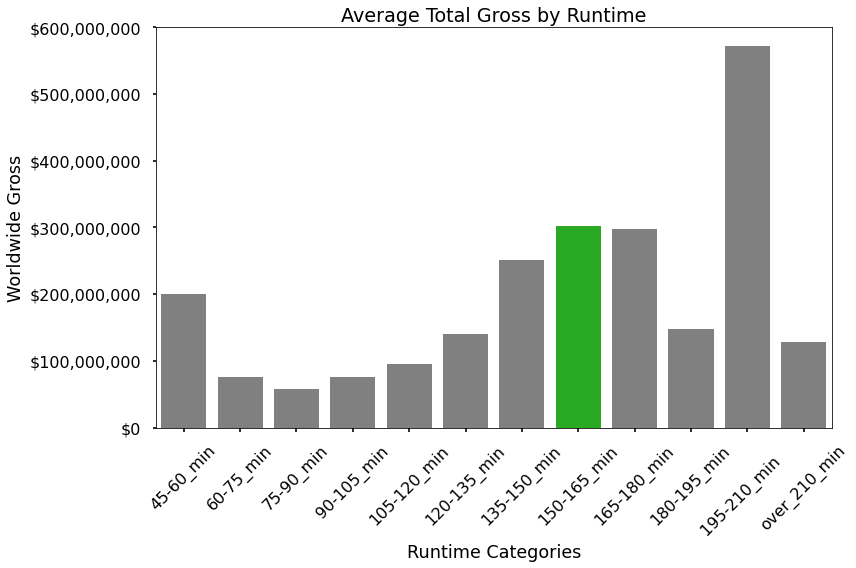
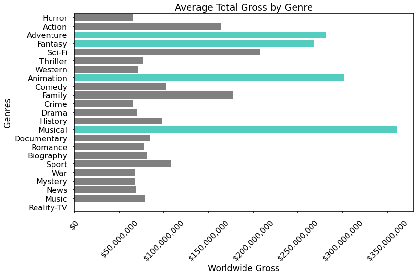
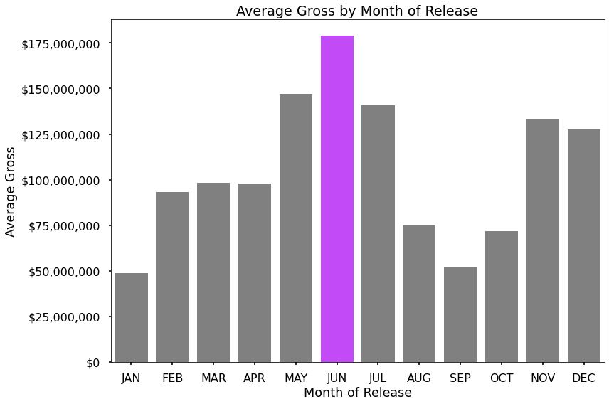

## Microsoft Needs Recommendations For A New Movie Studio

**Author**: [Jody Haring](mailto:jodyharing@gmail.com)

## Project Overview

This project will use exploratory data analysis to generate insights for Microsoft, a 2.25 Trillion company that is looking to create a new film studio to compete with other large companies in the film industry.

### Business Problem

Microsoft has decided to create a new movie studio, and needs insight on which films do best in the global box office. Microsoft needs actionable insights to help decide what type of films to create for their new studio.

### Data Understanding

In the folder `zippedData` are movie datasets, provided by the Flatiron School, from:

* [Box Office Mojo](https://www.boxofficemojo.com/)
* [IMDB](https://www.imdb.com/)
* [Rotten Tomatoes](https://www.rottentomatoes.com/)
* [TheMovieDB](https://www.themoviedb.org/)
* [The Numbers](https://www.the-numbers.com/)
* [The Movies Dataset](https://www.kaggle.com/rounakbanik/the-movies-dataset?select=movies_metadata.csv)

The final dataset used for analysis contain 3,795 movies from January 2000 to August 2017.

### Data Analysis

The best runtime to aim for is between 150 and 165 minutes. The reason I am not recommending a runtime between 195 and 210 minutes is because only two movies are represented in this category.

+

The highest average grossing films are categorized into four genres:
- Musical
- Animation
- Adventure
- Fantasy

+

The highest average grossing month to release a film is June, followed by the summer break months of May and July, with the holiday months of November and December following closely after.

+

  
### Conclusions

- Microsoft can improve their chances of success in their new film studio by focusing on films in Musical, Animation, and Adventure/Fantasy categories. 
- They may also improve profits by releasing their films in the summer or holiday seasons, with the month of June as a best target month. 
- A good target runtime is between 150 and 165 minutes.

### Next Steps

- Analyze the profit potential of the short film market.
- Explore budget and analyze costs of making a film. 
- Analyze recent films from 2017 to 2022 and explore the impacts of covid.

### For More Information

See the full analysis in the [Jupyter Notebook](./Final_Notebook.ipynb)

For questions, contact Jody Haring at [jodyharing@gmail.com](mailto:jodyharing@gmail.com)

